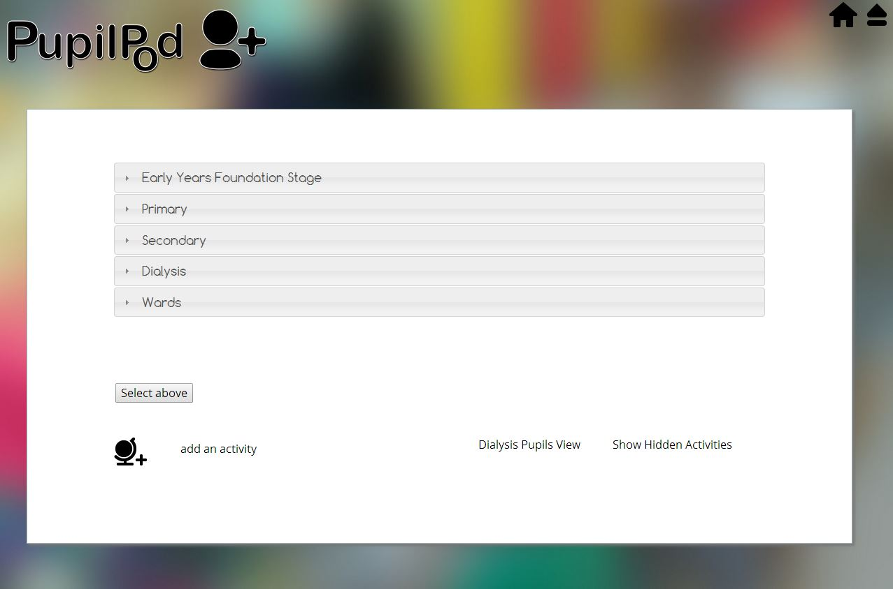

##Pupil Management Information System **MIS 2.0**

This is a pupil management system. Built in CakePHP 2.3 this version includes:

- Responsive design
- Multi-pupil processing *staff can add session notes to many pupils on one form*
- Better Registers *view and edit whole classes, page through weeks
- Auto email function completed *return attendance to schools via email
- Target module added
- Curriculum tree added *organise lesson plans by Keystage and subject pick and add to many pupils
- Reports orgainised by subject

Users log into the system

Each user has their own home page, admin users have access to pages like user management, a date of birth and year group tool. From here users enter the different modules and workflows.

Add pupils.

Find pupils.

A core function of the system is to record pupil attendance. Users do this in the attendance module.

You add a pupil or multiple pupils, then fill in their attendance.

A handy yellow marker will pick out the pupils you just added, as they are automatically sorted into phases

You can also just look at one pupil's attendance term by term

#Pupil Progress

In addition to recording a pupil's attendance this system will also track their progress.

###Targets

Targets start with either a generic target that each pupil in the school is set, or an individual's personal learning target.

###Activities

To achieve targets pupils engage in activities set by the teaching staff. Here they are orgainised by phase.

Staff drill down into the activities to select one or more activities that eithe one or a collection of pupils engaged in.

Once your activities have been selected you can add session attendance, comments, and indicate in a simple way the pupil's performance selecting if they met or didn't meet the activities objectives.

###Reporting

When you are ready you can pull a pupils report.

Chose how detailed you want the report to be.

###More

You get warnings upon deleting data like this.

To set this up you need to install cakePHP connect to an SQL database load the [database structure](./app/Config/pupilpod_database.sql) adjust your [app/Config/database.php.default](./app/Config/database.php.default) you will also have to set up the [email config file](./app/Config/email.php.default)
